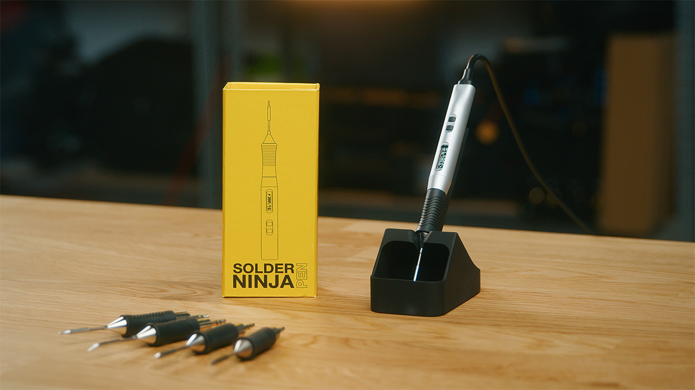

# Solder Ninja Pen Firmware

Firmware for the [Solder Ninja Pen](https://solder.ninja/pen/), a USB-powered soldering iron compatible with Weller RT Micro tips. The firmware provides temperature control, power management, user interface, and safety features for the device.

## Overview

The Solder Ninja Pen is a portable soldering iron that operates from USB power sources, supporting USB Power Delivery (PD), Quick Charge (QC), and legacy 5V modes. The firmware manages temperature control, power negotiation, user interface, and safety mechanisms.

The firmware is written using the Arduino framework with an emphasis on readability and accessibility rather than optimization. This approach makes the code easier to understand, modify, and contribute to for developers with varying levels of embedded systems experience.

## Features

- Temperature control from 0 to 350 degrees Celsius (400 degrees Celsius boost mode)
- USB power negotiation supporting USB: CDP (BC 1.2), DCP, HVDCP (Quick Charge), and PD (Power Delivery)
- User interface with an OLED display and buttons
- Safety features including sleep on idle, sleep on magnet detection, and lock on free fall
- Accelerometer-based motion detection for automatic sleep mode
- Serial communication API for remote control and monitoring

## Installation

Pre-built firmware binaries are available in the [releases section](https://github.com/sitronlabs/Solder-Ninja-Pen-Firmware/releases). UF2 files are provided for easy USB bootloader installation. A web-based firmware updater is also available at [solder.ninja/app](http://solder.ninja/app) for convenient browser-based installation.

## Building

This project uses PlatformIO for building and development.

### Prerequisites

- [Visual Studio Code](https://code.visualstudio.com/) with the [PlatformIO IDE extension](https://platformio.org/install/ide?install=vscode)
- USB cable connected to the computer for flashing

### Build Instructions

1. Clone this repository with `git clone https://github.com/sitronlabs/Solder-Ninja-Pen-Firmware.git` or download the [code as zip](https://github.com/sitronlabs/Solder-Ninja-Pen-Firmware/archive/refs/heads/master.zip) if you are unfamiliar with git.

2. Open the `Solder-Ninja-Pen-Firmware` folder in Visual Studio Code. PlatformIO will automatically detect the project and install dependencies. 

3. Use the PlatformIO toolbar to build, and upload to the device. The device should be automatically reset into bootloader mode by PlatformIO, if not unplug your device, and plug it again while holding the left button.

## Communication API

The firmware provides a JSON-based serial communication API for remote control and monitoring. Commands are sent as JSON objects and responses are returned in JSON format. For detailed API documentation, see [src/com/com.md](src/com/com.md).

## Project Structure

- `cfg/`: Configuration override
- `res/`: Resources (icons)
- `scripts/`: Build scripts for version generation and icon conversion
- `src/`: Source code
  - `main.cpp`: Main entry point and task scheduler
  - `controller/`: Temperature control and state management
  - `power/`: USB power negotiation and management
  - `interface/`: User interface (display, buttons, accelerometer, magnet sensor)
  - `com/`: Serial communication API
  - `settings/`: Persistent settings management
  - `log/`: Logging system
  - `watchdog/`: Watchdog timer

## Contributing

Contributions are welcome through [pull requests](https://github.com/sitronlabs/Solder-Ninja-Pen-Firmware/pulls). Please ensure code follows the existing style and includes appropriate documentation. Note that review time may be limited, so responses to pull requests may take some time.

You are also welcome to request a feature by [opening an issue](https://github.com/sitronlabs/Solder-Ninja-Pen-Firmware/issues). However, due to limited time, there are no guarantees that feature requests will be implemented.

## Resources

- [Product page](https://www.solder.ninja/pen)
- [Crowd Supply campaign page](https://www.crowdsupply.com/sitron-labs/solder-ninja-pen)
- [Discord community](https://discord.gg/btnVDeWhfW)